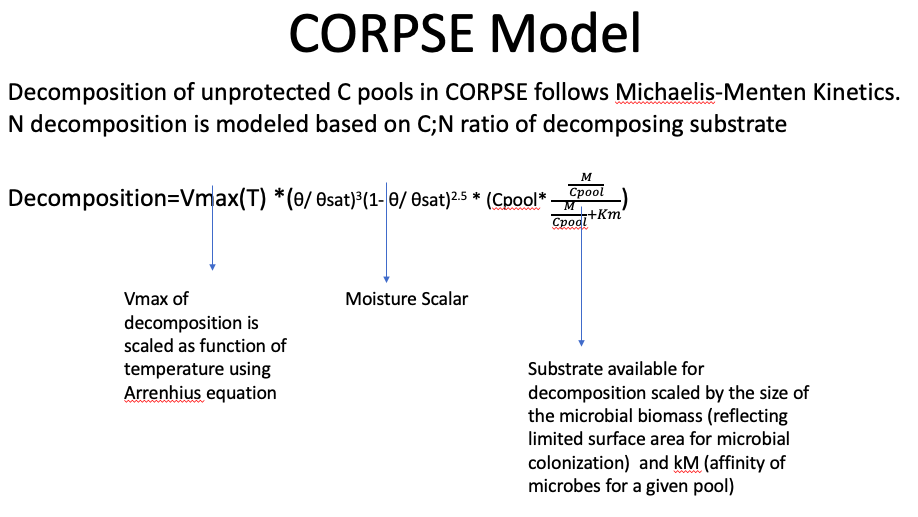

<style type="text/css">
h1 { /* Header 1 */
  font-size: 22px;
  color: DarkBlue;
}
h2 { /* Header 2 */
    font-size: 18px;
  color: DarkBlue;
}
h3 { /* Header 3 */
    font-size: 14px;
  color: DarkBlue;
}
.main-container {
  max-width: 700px;
  margin-left: auto;
  margin-right: auto;
}
body, td {
   font-size: 16px;
}
</style>

# Background
Understanding how ectomycorrhizal (EMF) and saprothophic (SAP) Fungi interact with plants, soil, and each other is fundamental to understanding soil organic matter (SOM) dynamics. Specifically, each have functional roles in both biochemical and physiochemical protection of SOM. We hypothesize that these interactions will affect particulate organic matter (POM) and mineral-associated organic matter (MAOM) in different ways. 

<br>

We are modeling these interactions following a SOM decomposition model that used Michaelis-Menten Kinetics as its basis for substrate decomposition. 

<br>
<br>

<center>


</center>

<br>
<br>

***

<br>

# Hypotheses
 * H1.
 
 * H2.
 
 * H3.

 
***

<br>

# Methods
## Create some data

Load packages and set random seed

```{r echo = TRUE, results = 'hide', message = FALSE, fig.show = 'hide', warning = FALSE}

# load packages and set random seed
packages <- c("ggplot2", "ggthemes", "scales")
#lapply(packages, install.packages, character.only = TRUE)
lapply(packages, library, character.only = TRUE)
set.seed(35)
```

<br>

Set initial carbon pool sizes and create daily temperature and moisture data to run the model. The model currently tracks six pools - POM, MAOM, microbial necromass, ECM fungi biomass C, SAP fungi biomass C, and cumulative CO~2~ flux.

```{r echo = TRUE, message = FALSE, fig.show = 'hide', warning = FALSE}

# initial C pool sizes - p = pom, m = maom, n = necromass
cpools <- data.frame(
                    "bulkpc" = 1,        # bulk C pool size
                    "bulkmc" = 1,        # 
                    "bulknc" = 1,        #
                    "ecmmbc" = 0.001,    # ECM microbial biomass C pool size
                    "sapmbc" = 0.001,    # SAP microbial biomass C pool size
                    "cumco2" = 0         # cumulative CO2 flux
)
  
# daily temperature (temp) and vwc (theta)
dat <- data.frame(
                  "day"  = c(1:365),
                  "temp" = rnorm(365, 296.10, 0.2), 
                  "theta"= rnorm(365, 0.33, 0.01)
)
head(dat)
```

<br>

Set parameters

```{r echo = TRUE, message = FALSE, fig.show = 'hide', warning = FALSE}

# set parameters
theta <- 0.32                          # volumetric water content (vwc)
thetasat <- 0.45                       # vwc at field capacity
minrhiz <- 0.02                        # min fraction of soil that is rhizosphere
maxrhiz <- 0.5                         # max fraction of soil that is rhizosphere
startday <- 1                          # day to start
endday <- 365                          # day to end
yrtoday <- 1/365                       # conversion factor for year to daily step
chem_types <- c('Pom','Maom','Necro')  # pool names
params <- data.frame(
                    "Vmaxref_Pom" = 9.0,              # relative max decomp rate
                    "Vmaxref_Maom" = 0.25,            # ''
                    "Vmaxref_Necro"= 4.5,             # ''
                    "Ea_Pom" = 5e3,                   # enzyme affinity
                    "Ea_Maom" = 30e3,                 # ''
                    "Ea_Necro"= 3e3,                  # ''
                    "kC_Pom" = 0.01,                  # Michaelis constant
                    "kC_Maom" = 0.01,                 # ''
                    "kC_Necro"= 0.01,                 # ''
                    
                    "gas_diffusion_exp" = 0.6,        # not used
                    "minNecrobeC" = 1e-3,             # not used
                    "Tmic"= 0.25,                     # not used
                    "et" = 0.6,                       # not used
                    
                    "eup_Pom" = 0.6,                  # C uptake efficiency
                    "eup_Maom"= 0.1,                  # ''
                    "eup_Necro" = 0.6,                # ''
                    "ecm_advantage" = 0.6,            # competitive advangtage of ECM
                    
                    "frac_N_turnover_min" = 0.2,      # not used
                    "protection_rate_Pom" = 0.7,      # not used
                    "protection_rate_Maom" = 0.001,   # not used
                    "protection_rate_Necro" = 4.0,    # not used
                    "nup_Pom" = 0.3,                  # not used
                    "nup_Maom" = 0.3,                 # not used
                    "nup_Necro" = 0.3,                # not used
                    "CN_Necrobe" = 7,                 # not used
                    "max_immobilization_rate" = 3.65, # not used
                    "substrate_diffusion_exp" = 1.5,  # not used
                    "new_resp_units" = TRUE,          # not used
                    "iN_loss_rate" = 5.0,             # not used
                    "frac_turnover_Maom" = 0.2        # not used
)
# replaced the following parameter after "eup_Necro":
#"tProtected" = 100.0,

params[,1:5]
```

## Create some functions

Simulate the rhizosphere fraction from root growth in potted plants

```{r echo = TRUE, results = 'hide', message = FALSE, warning = FALSE}

# rhizosphere fraction of potted plant - function of day, scaled to min and max rhizosphere size
rhizfrac <- function(x) {
  expo <- 1/3
  frng <- c(startday ^ expo, endday ^ expo)
  rhizfrac <- x ^ expo 
  rhizfrac <- rescale(rhizfrac, to = c(minrhiz, maxrhiz), from = frng)
  return(rhizfrac)
}

# plot rhizosphere function
plot(rhizfrac(day) ~ day, data = dat, ylab = "Rhizosphere fraction", xlab = "Day")
```

Calculate Vmax based on temperature, gas constant, and enzyme affinity

```{r echo = TRUE, results = 'hide', message = FALSE, warning = FALSE}

# Vmax - function of temperature, the universal gas constant (J/mol.K), vmaxref, and affinity
Vmax <- function (T, params, Tref=293.15, Rugas=8.314472) {
  Vmax <- data.frame(
                    params[paste('Vmaxref_', chem_types, sep = '')] * 
                    exp(-params[paste('Ea_', chem_types, sep = '')] * (1.0 / (Rugas * T) - 1.0 / (Rugas * Tref)))
                    )
  names(Vmax) <- chem_types
  return(Vmax)
}

# calculate Vmax for a span of temperatures
t <- c(265:310)
vm <- data.frame(Pom = rep(0, length(t)), Maom = rep(0, length(t)), Necro = rep(0, length(t)))
for (i in 1:length(t)) {
  vm[i,] <- Vmax(t[i], params)[1,]
}
vm <- cbind(t, vm)

# plot vmax ~ temperature
vp <- ggplot(data = vm) +
      geom_point(aes(x = t, y = Pom, color = "blue"),
            alpha = 1,
            size = 1) +
      geom_point( aes(x = t, y = Maom, color = "orange"),
            alpha = 1,
            size = 1) +
      geom_point(aes(x = t, y = Necro, color = "brown"),
            alpha = 1,
            size = 1) +
     labs(y = "Vmax",
          x = "Temperature")+
     scale_color_identity(name = "Pool",
                          breaks = c("blue", "orange", "brown"),
                          labels = c("Pom", "Maom", "Necro"),
                          guide = "legend")
vp + theme_few()
```

Calculate decomposition based on Michaelis-Menten kinetics, where $\theta$~sat~ = 0.45

```{r echo = TRUE, results = 'hide', message = FALSE, warning = FALSE}

# decomposition rate - function of Vmax, theta, thetasat, C pool size, mic. biomass, and year to day scalar
decomp <- function(T, theta, thetasat, cpools, params, yrtoday, Tref=293.15, Rugas=8.314472) {
   # Vmax * (theta scalar * c pools scaled by mic. biomass C) * annual to daily scalar
    (
      params[paste('Vmaxref_', chem_types, sep = '')] * 
      exp(-params[paste('Ea_', chem_types, sep = '')] * 
      (1.0 / (Rugas * T) - 1.0 / (Rugas * Tref)))
    ) * 
    (
    ((theta / thetasat) ^ 3) * ((1 - (theta / thetasat)) ^ 2.5) * 
      (cpools[, 1:3] * (((cpools[, 4] + cpools[, 5]) / cpools[, 1:3]) / ((cpools[, 4] + cpools[, 5]) / cpools[, 1:3]) + params[,7:9]))
    ) *
    yrtoday
}

# calculate decomp for a span temperatures
vm2 <- (vm[,1])
dec <- data.frame(
                  bulkpc= rep(0, length(vm2)), 
                  bulkmc = rep(0, length(vm2)), 
                  bulknc = rep(0, length(vm2))
                  )
for (i in 1:length(vm[,1])) {
  dec[i,] <- decomp(vm2[i],theta, thetasat, cpools, params, yrtoday, Tref=293.15, Rugas=8.314472)
}
dec <- cbind(vm$t, dec)
colnames(dec)[1] <- "t"

# plot decomp ~ temperature
dp <- ggplot(data = dec) +
      geom_point(aes(x = t, y = bulkpc * 1000, color = "blue"),
            alpha = 1,
            size = 1) +
      geom_point(aes(x = t, y = bulkmc * 1000, color = "orange"),
            alpha = 1,
            size = 1) +
       geom_point(aes(x = t, y = bulknc * 1000, color = "brown"),
            alpha = 1,
            size = 1) +
     labs(y = expression(paste("Daily Decomposition at ", 
                    theta[0.32],
                    " (g C loss)", sep = "")),
          x = "Temperature")+
     scale_color_identity(name = "Pool",
                          breaks = c("blue", "orange", "brown"),
                          labels = c("Pom", "Maom", "Necro"),
                          guide = "legend")
dp + theme_few()

# calcuate decomp ~ theta
th <- seq(0.1, 0.55, 0.01)
t <- rep(290, length(th))
decth <- data.frame(
                  bulkpc= rep(0, length(th)), 
                  bulkmc = rep(0, length(th)), 
                  bulknc = rep(0, length(th))
                  )
for (i in 1:length(th)) {
  decth[i,] <- decomp(t[i],th[i], thetasat, cpools, params, yrtoday, Tref=293.15, Rugas=8.314472)
}
decth <- cbind(th, decth)

# plots decomp ~ theta
dt <- ggplot(data = decth[1:35,]) +
      geom_point(aes(x = th, y = bulkpc * 1000, color = "blue"),
            alpha = 1,
            size = 1) +
      geom_point(aes(x = th, y = bulkmc * 1000, color = "orange"),
            alpha = 1,
            size = 1) +
       geom_point(aes(x = th, y = bulknc * 1000, color = "brown"),
            alpha = 1,
            size = 1) +
     labs(y = "Daily Decomposition at 290 K (g C loss)",
          x = expression(paste(theta, " where ", theta[sat], " = 0.45", sep = "")))+
     scale_color_identity(name = "Pool",
                          breaks = c("blue", "orange", "brown"),
                          labels = c("Pom", "Maom", "Necro"),
                          guide = "legend")
dt + theme_few()
```

## Create a model loop

```{r echo = TRUE, results = 'hide', message = FALSE, warning = FALSE}

# model loop
modcpools <- data.frame("bulkpc" = rep(0, length(dat[,1])), 
                        "bulkmc" = rep(0, length(dat[,1])),
                        "bulknc" = rep(0, length(dat[,1])),
                        "ecmmbc" = rep(0, length(dat[,1])),
                        "sapmbc" = rep(0, length(dat[,1])),
                        "cumco2" = rep(0, length(dat[,1]))
                        )
modcpools[1,] <- cpools[1,]
for (i in 1:length(dat[,1])) {
  # calculate overall decomp
  deco <- decomp(dat$temp[i], dat$theta[i], thetasat, 
                 modcpools[i,], params, yrtoday, Tref=293.15, Rugas=8.314472)
  
  # calculate soil pool size
  modcpools[i+1, 1:3] <- modcpools[i, 1:3] - deco
  
  # calculate microbial uptake
  puptk <- deco[,1] * params$eup_Pom
  muptk <- deco[,2] * params$eup_Maom
  nuptk <- deco[,3] * params$eup_Necro
  tuptk <- sum(puptk, muptk, nuptk)
  modcpools$ecmmbc[i+1] <- modcpools$ecmmbc[i] + (tuptk * params$ecm_advantage)
  modcpools$sapmbc[i+1] <- modcpools$sapmbc[i] + (tuptk * (1-params$ecm_advantage))
   
  # calculate cumulative CO2 flux
  modcpools$cumco2[i+1] <- modcpools$cumco2[i] + (sum(deco) - tuptk)
}
modcpools <- cbind(1:366, modcpools)
colnames(modcpools)[1] <- "day"
```

## Take a look at model results

```{r}

# plot model results for soil pools
dt <- ggplot(data = modcpools) +
      geom_point(aes(x = day, y = bulkpc * 1000, color = "blue"),
            alpha = 1,
            size = 1) +
      geom_point(aes(x = day, y = bulkmc * 1000, color = "orange"),
            alpha = 1,
            size = 1) +
       geom_point(aes(x = day, y = bulknc * 1000, color = "brown"),
            alpha = 1,
            size = 1) +
     labs(y = "Decomposition (g C loss)",
          x = "Day")+
     scale_color_identity(name = "Pool",
                          breaks = c("blue", "orange", "brown"),
                          labels = c("Pom", "Maom", "Necro"),
                          guide = "legend")
dt + theme_few()

# plot model results for microbe pools and co2
dt <- ggplot(data = modcpools) +
      geom_point(aes(x = day, y = ecmmbc, color = "green"),
            alpha = 1,
            size = 1) +
      geom_point(aes(x = day, y = sapmbc, color = "red"),
            alpha = 1,
            size = 1) +
       geom_line(aes(x = day, y = cumco2, color = "black"),
            alpha = 1,
            size = 1,
            linetype = "dashed") +
     labs(y = "Pool size (g C)",
          x = "Day")+
     scale_color_identity(name = "Pool",
                          breaks = c("green", "red", "black"),
                          labels = c("ECM biomass C", "SAP biomass C", "Cumulative CO2 flux"),
                          guide = "legend")
dt + theme_few()

```

These are the modeling results of the decomposition function with substrate availability scaled by microbial biomass. ECM outcompetes SAP - set with the competition scalar.


